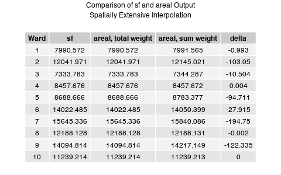
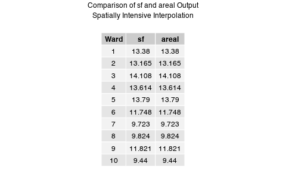

# Introduction
Population data are often available at various levels of aggregation, such as census tracts or block groups in the United States or output areas in the United Kingdom. These units are often drawn for convenience and not because they represent some commonly accepted area in residents' lived experiences. Despite this, researchers often use them as proxies for neighborhoods since they come with readily available data and the techniques for estimating population values for overlapping but incongruent areas, such as a shapefile of neighborhood boundaries for a city, are less accessible. For researchers who do wish to move past these proxies and produce population estimates for features of interest, the lack of accessibility means that they typically resort to developing their own, often manual, implementations of the areal weighted interpolation workflow [@qiu2012development]. 

Unlike interpolation techniques, like inverse distance weighted interpolation, that are appropriate for point data, areal weighted interpolation is designed specifically for working with already aggregated data to some set of polygon spatial features [@lam1983spatial]. Estimating population values from these data to an overlapping but incongruent set of polygon features is known as the *polygon overlay problem* [@goodchild1978statistical], with the original data known as the "source" data and the overlapping set of features known as the "target" data [@markoff1973linkage]. The estimation process vary based on whether data are spatially *extensive* (i.e. count data) or spatially *intensive* [i.e. ratios, percentages, means, or medians; @goodchild1980areal].

In estimating values for the target features, areal weighted interpolation makes a significant assumption that individuals are evenly spread throughout the source features [@qiu2012development]. This assumption often breaks down in practice - a census tract with a large park in it, for example, or a neighborhood that has a significant commercial area alongside residential housing. While more complex methods do exist to compensate for violating this assumption, there are few tools to implement them, and the strategies have mainly remained the focus of academics instead of GIS practitioners [@langford2007rapid; @qiu2012development].

# The areal R package
The `areal` package aims to reduce the barriers to the implementation of areal interpolation in spatial researchers' work. By implementing the process in `R`, we aim to improve the reproducibility of the interpolation process, which is often done manually using point-and-click desktop GIS software. We also aim to provide additional functionality in comparison to the one existing approach found in the `sf` package [@pebesma2018simple], the `st_interpolate_aw()` function, while providing support for modern data management (e.g. `tidyverse`) and spatial data (e.g. `sf`) frameworks. 

Therefore, we provide functions that:

1. validate data suitability for areal interpolation,
2. allow for friction-less, iterative interpolation of both spatially extensive (e.g., count) and intensive (e.g., ratio) data, and
3. provide a manual workflow for implementing the interpolation process as well as a single omnibus function.

The validation process checks for five conditions that must be met prior to interpolation:

1. Are both objects `sf` objects?
2. Do both objects share the same coordinate system?
3. Is that coordinate system planar?
4. Do the given variables exist in the source data?
5. Will interpolation overwrite columns in the target data?

This validation process can be run independently by end users via the `ar_validate()` function and is also run initially when `aw_interpolate()` is called. The validation process is aimed at helping users new to both `R` and areal interpolation ensure they have arranged their data correctly.

Unlike existing approaches, the `areal` package offers the ability to interpolate multiple variables in a single function call and provides a wider set of options for making these estimates. For spatially extensive interpolations, we offer a formula that matches the existing functionality in `sf`, which is based on the total area of the original source feature (specified with `weight = "total"`). Alternatively, we offer a second formula that is more suitable for data where there should be complete overlap between the source and target data, but there is not. Such incongruity could be due to data quality issues or variation in how different sources represent particular geographies. This uses a sum of the source feature areas remaining after the data are intersected as part of the spatial weight calculation process (specified with `weight = "sum"`).

Our package also provides a manual approach for calculating estimates alongside the primary function `aw_interpolate()`. This is important for users who need to unpack the interpolation workflow and diagnose data issues that occur during interpolation as well as programmers who want to use a portion of the workflow in their software. Finally, `areal` provides both spatial (`sf` object) and a-spatial (`tibble` object) options for output.

# A Short Example
Once data have been prepared for interpolation, meaning they share the same projected coordinate system and there are no conflicts between variable names, interpolations can be calculated with a single function `aw_interpolate()`. This functionality is illustrated here using source and target data built into the `areal` package:

```r
> aw_interpolate(ar_stl_wards, tid = WARD, source = ar_stl_race, sid = GEOID,
+   weight = "sum", output = "tibble",
+   extensive = c("TOTAL_E", "WHITE_E", "BLACK_E"))
# A tibble: 28 x 6
   OBJECTID  WARD       AREA TOTAL_E WHITE_E BLACK_E
      <dbl> <int>      <dbl>   <dbl>   <dbl>   <dbl>
 1        1     1  46138761.   7992.    153.   7779.
 2        2     2 267817711.  12145.   1323.  10639.
 3        3     3  66291644.   7344.    591.   6635.
 4        4     4  53210707.   8458.    160.   8203.
 5        5     5  60462396.   8783.   1526.   7056.
 6        6     6  64337271.  14050.   5840.   7439.
 7        7     7 101268146.  15840.   8220.   6629.
 8        8     8  45966410.  12188.   7604.   3796.
 9        9     9  73993891.  14217.   6838.   6413.
10       10    10  62915358.  11239.   8703.   1667.
# … with 18 more rows
```

If a `sf` object is desired, changing the `output` argument in the example above to `"sf"` will provide not only the estimated values but the relevant geometric data as well.

Spatially intensive interpolations, which are used by analysts for data that are ratios or percentage values, can be calculated by replacing the `extensive` argument with `intensive`. Alternatively, both arguments and corresponding vectors of variable names can be provided to interpolate both spatially extensive and intensive data simultaneously. 

The source data from the above data along with one of the variables, total population (`TOTAL_E`), are mapped in panel A below at the census tract level. The resulting data for the total population variable interpolated to the target political ward data have been mapped in panel B:


Additional examples and vignette illustrations of `areal`'s functionality are available on the package's [website](https://slu-openGIS.github.io/areal/).

# A Quick Comparison with sf
Since `sf` offers similar functionality, three comparisons are made and presented here. Code for these comparisons is available in an appendix within the `areal` [GitHub repository](https:://github.com/slu-openGIS/areal/paper/appendix.md). The first compares spatially extensive interpolations calculated in both `areal` and `sf`. The first ten features are shown here for comparison:



Both `st_interpolate_aw()` and `aw_interpolate()` with the `weight = "total"` produce identical results, which is expected. 

The above comparison also shows the difference between using `"total"` and `"sum"` for the `weight` argument in `aw_interpolate()`. If we expect that our source and target data should overlap completely (but perhaps do not because of data quality issues), the `"sum"` approach will allocate all individuals into target features whereas `"total"` will not because it uses the total area of each source feature. In the example data provided in the `areal` package, this is the case - the Census tracts do not perfectly map onto the extent of the wards, and so the `"total"` approach is inappropriate. 

The differences are highlighted in the `delta` column in the above figure. With these data, the `"total"` approach yields generally smaller results that the `"sum"` approach, with an average difference of -30.781. The largest difference between the `"total"` and `"sum"` approaches was -194.750 individuals. The added functionality within `areal` therefore provides a potentially more accurate set of estimations in similar cases where data should overlap, but do not.

The second comparison is with spatially intensive interpolations. For this approach, both `st_interpolate_aw()` and `aw_interpolate()` should yield identical results. As before, the first ten features are shown here for comparison:



As with the extensive interpolations where `weight = "total"`, both `st_interpolate_aw()` and `aw_interpolate()` produce the expected identical results. 

## Notes on Performance
Finally, a comparison of the speed at which both the `sf` and `areal` packages calculated these values is included in [appendix](https:://github.com/slu-openGIS/areal/paper/appendix.md) as well. For the extensive interpolations, `aw_interpolate()` performed 21 milliseconds slower with these data, with a mean execution time of 276.505 milliseconds. Similarly, the intensive interpolations were 22 milliseconds slower when using `areal`, which had a mean execution time of 273.552 milliseconds. Both comparisons were made using the `R` package `microbenchmark`.

One particular performance concern to note are intersections (a step in the interpolation process) that return geometry collections. These will cause `st_interpolate_aw()` function from `sf` to error. The `aw_interpolate()` function will not error, but instead will correctly address these geometry collections before proceeding with the interpolation. However, the correction process can take significantly longer than a similar data set that does not require this additional step.

The [appendix](https:://github.com/slu-openGIS/areal/paper/appendix.md) contains an example of interpolation population from Missouri's 115 counties into its 4,506 Census block groups. When evaluated with `microbenchmark`, the average length of time to complete this process was 19.791 seconds.

# Availability
`areal` is open source software made available under the GNU GPL-3 license. It can be installed through CRAN [@prener2019areal] using: `install.packages("areal")`. `areal` can also be installed from its GitHub repository using the `remotes` package: `remotes::install_github("slu-openGIS/areal")`.

# Acknowledgements
The authors wish to thank their colleagues, J.S. Onésimo Sandoval, Ph.D. and Taylor Harris Braswell, M.A., for reviewing an initial draft of this manuscript. 

# References
